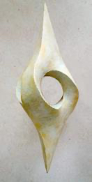
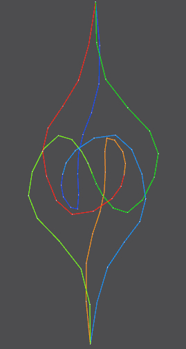
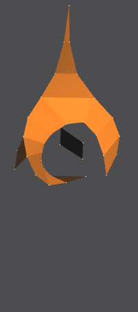
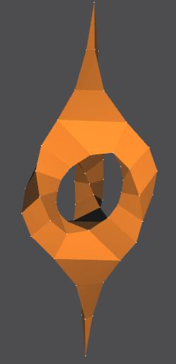
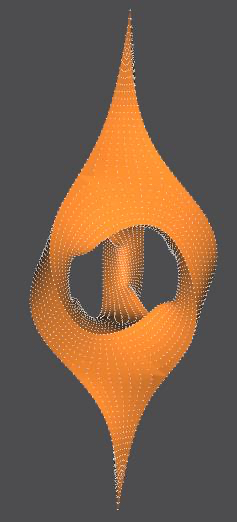

# Introduction
The JIPCAD project is supervised by UC Berkeley professor Carlo Sequin and developed by JIPCAD group.
Let's discover **JIPCAD** and empower your creativity with this tool.

JIPCAD (Joint-Interactive-Procedural CAD) is a 3D procedural CAD tool used for programmatically creating geometries with a shape description language. Users can interactively modify the scene in a graphical user interface and save modifications back into the corresponding file as reusable code; a reopening of the enhanced file will reproduce the latest graphical state, and the user can continue in either a graphical manner or by textual changes in the .nom file.

JIPCAD combines procedural and interactive modeling, making it easier for users to model 2-manifold free-form surfaces of high complexity and inherent regularity. In this report, we will discuss JIPCAD and the development of its shape description language and graphical editing capabilities over the past year. Key contributions include generalized progressive sweeps along arbitrary 3D space curves, dynamic scenes, advanced shape generators for tori, error catching, graphical editing and saving capabilities, and advanced rendering options.

## Why JIPCAD
There are many existing 3D modeling tools out there in the market, such as Blender, OpenSCAD, and Maya; however, these tools do not strike a good balance between procedural shape creation and interactive graphical editing capabilities.

Berkeley SLIDE (Scene Language for Interactive Dynamic Environments) is a CAD tool originally developed in the early 2000’s and can be used to construct abstract geometrical sculptures with a shape description language. However, it has not been maintained for over a decade and is not compatible with recent versions of operating systems. Implementation-wise, SLIDE represents meshes as two-sided surfaces, so it is limited in its ability to subdivide and offset single-sided surfaces, such as Möbius bands and Klein bottles.

In 2018, NOME (Non-Orientable Manifold Editor) was introduced to handle singled-side, non-orientable surfaces and to add interactive graphical editing capabilities. The initial version of NOME offered only a few of the procedural shape generators that were available in SLIDE, and it was difficult to save the changes that were made graphically in a form compatible with the procedural scene description file. Also, its implementation code was rather “ad-hoc” and made it difficult to enhance NOME’s capabilities.

The past efforts and related tools have not found a good balance between procedural mesh generation and interactive GUI modifications. Thus, we have developed a new modeling tool, called JIPCAD (JointInteractive-Procedural CAD), that extends NOME by re-implementing it on a more robust, wellstructured code base and by enhancing the library of predefined shape generators. Many additional modification modes were added to the graphical user interface, and the means of saving those changes and appending it to the original procedural JIPCAD file were improved. The challenges involved are not only generating the shapes and preserving their hierarchical relationships, but also saving interactive changes back into the code for reuse. We decided to rebrand NOME as JIPCAD since the tool’s ability to handle non-orientable surfaces is no longer its distinguishing feature.

## The Current JIPCAD

JIPCAD has been made the tool for robustness and with features such as generalized progressive sweeps along arbitrary 3D space curves, dynamic scenes, advanced shape generators for tori, graphical editing and saving capabilities, error catching, a user-friendly crystal ball interface, advanced rendering options, and more. We have also fixed the mesh data structure to handle various non-orientable surfaces while being compatible with our newly added features. JIPCAD users can generate topologically complex 2-manifolds through an iterative workflow, which may start with procedurally generated B-spline curves, to which discrete surface facets are added through a graphical user interface. This is demonstrated in the construction of the “3-2-1” Sculpture by Tord Tengstrand.

Sculpture by Tord Tengstrand |B-splines added           |intermediate construction step          |  completed construction | sharp subdivision applied
:-------------------------:|:-------------------------:|:-------------------------:|:-------------------------:|:-------------------------:
   |    |   |   |  

